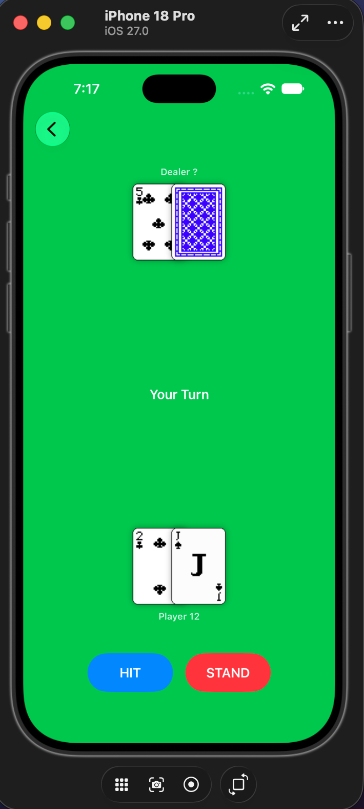
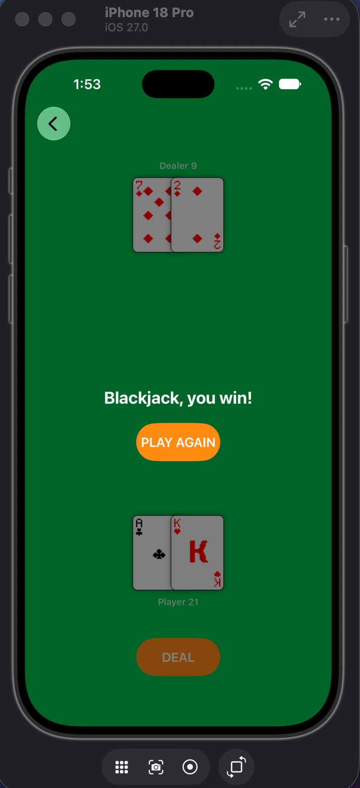

# Blackjack ♠️♥️

A single-player Blackjack (21) card game for iPhone and iPad, built entirely in
SwiftUI. Tap, swipe, or double-tap the table to deal, hit, and stand against a
dealer that draws to 17.

> Coursework project for **MTD367 iOS Development** (SUSS, Year 3 Semester 1).




---

## Features

- **Full Blackjack rules** — deal, hit, stand, dealer draws to 17, bust, push, and blackjack detection.
- **Soft-ace scoring** — an Ace counts as 11 or 1, automatically reduced to avoid a bust.
- **Dealer hole card** — dealt face down and revealed with a 3D flip when the round resolves.
- **Two-card Blackjack check** — a natural 21 is caught immediately after the deal.
- **Auto-reshuffle** — the deck is rebuilt once fewer than 15 cards remain, so play never stalls.
- **Multiple ways to play** — on-screen buttons plus swipe, double-tap and long-press gestures.
- **Sound effects** — card deal, hole-card flip, and distinct win/lose/push stings.
- **Accessibility-aware** — respects the system "Reduce Motion" setting, skipping animations and flipping cards instantly when it is enabled.
- **Built-in rules sheet** — an in-game reference for card values, play and gestures.

## Rules Implemented

| Rule | Behaviour |
| --- | --- |
| Card values | 2–10 face value; J, Q, K = 10; Ace = 11 or 1 |
| Objective | Finish closer to 21 than the dealer without going over |
| Dealer | Must draw while the total is below 17, then stand |
| Bust | Any total over 21 loses immediately |
| Blackjack | A two-card 21; beats a three-card 21 |
| Push | Equal totals are a draw |
| Shoe | Reshuffles automatically when fewer than 15 cards remain |

## Controls

| Input | Action |
| --- | --- |
| **DEAL** button / double tap | Start or restart a round |
| **HIT** button / swipe up | Draw another card |
| **STAND** button / swipe down | End your turn, dealer plays |
| Long press | Open the Rules & Hints sheet |

## Project Structure

```
blackjack/
├── blackjackApp.swift          # @main entry point
├── MainMenuView.swift          # Title screen (Play / Rules)
├── GameTableView.swift         # Table, HUD, controls, result overlay
├── CardView.swift              # Card rendering + flip animation
├── RulesView.swift             # Rules sheet
├── SoundPlayer.swift           # AVAudioPlayer pool
├── Models/
│   ├── Card.swift              # Suit / Rank enums, asset naming
│   ├── Deck.swift              # 52-card deck, shuffle, draw
│   ├── Hand.swift              # Soft-ace total, bust & blackjack checks
│   └── Game.swift              # @Observable game state machine
├── Sounds/                     # deal, flip, win, lose, push (.wav)
└── Assets.xcassets/            # Full 52-card art + blue/red backs
```

## Architecture

The game logic is kept out of the views. `Game` is an `@Observable` object that
owns the deck, both hands, and a `State` machine (`idle → playerTurn → blackjack
→ dealerTurn → roundOver`). Views react to state changes and call `deal()`,
`hit()` and `stand()`; they never mutate hands directly. `Deck` and `Hand` are
value types (`struct`), so copies are independent and the model stays testable
without UI.

## Getting Started

1. Clone the repository.
2. Open `blackjack.xcodeproj` in Xcode.
3. Select an iPhone or iPad simulator (or a connected device).
4. Build and run (`⌘R`).

**Requirements:** Xcode with the iOS 26.5 SDK or later. Deployment target is
iOS 26.5; the app supports both iPhone and iPad.

## Credits

- Card fronts, card backs and chip artwork are royalty-free assets.
- Sound effects: [Kenney](https://kenney.nl) *Casino Audio* and *Interface Sounds* packs (CC0).

## Disclaimer

Created for academic coursework. Not affiliated with any casino or gambling
service, and no real money or betting is involved.
